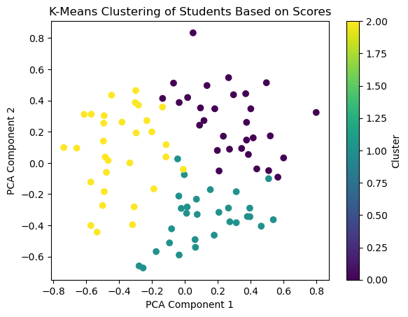
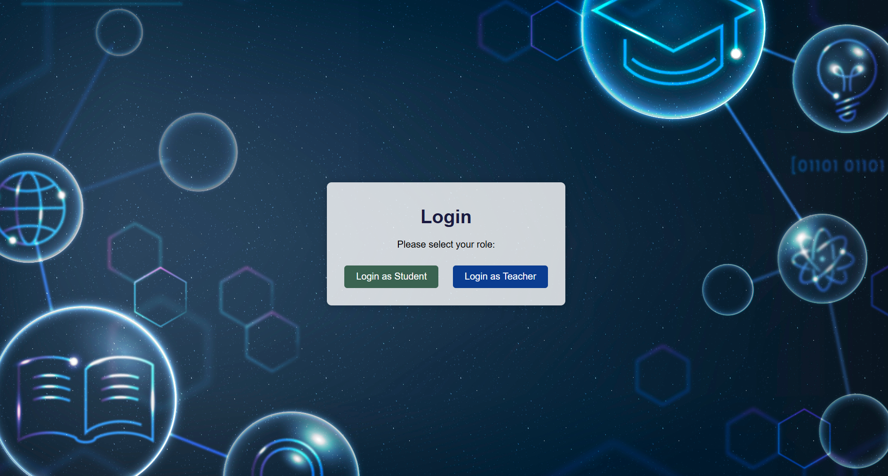

# PeerSkillUp

**Team Name:** Nexoria  
**Team Members:** Shrivatsa, Ronith, Prarthana, Sunith

## Table of Contents
1. [Project Overview](#project-overview)
2. [Features](#features)
3. [Tech Stack](#tech-stack)
4. [Project Structure](#project-structure)
5. [Current Progress](#current-progress)
6. [Future Enhancements](#future-enhancements)
7. [How to Run](#how-to-run)
8. [Testing the Model and API with Postman](#testing-the-model-and-api-with-postman)
9. [UI Screenshots](#ui-screenshots)


## Project Overview
**PeerSkillUp** is an AI-enhanced peer learning platform aimed at fostering a supportive and collaborative educational environment. 
The platform connects students based on their individual strengths and weaknesses using intelligent matching algorithms. 
By facilitating personalized peer interactions and providing tailored study recommendations, PeerSkillUp enhances the overall 
learning experience. It features a comprehensive student dashboard that displays peer matches, highlights subject areas needing improvement, 
and provides access to lecturer-shared resources. The teacher dashboard offers insights into student performance, 
highlights weaker subjects, and allows resource sharing to assist students. The project leverages a tech stack including 
Flask (Python), MongoDB, and machine learning models, with a user-friendly front end built using HTML, CSS, and JavaScript. 
PeerSkillUp aims to make education more effective and accessible through AI-driven peer support.


## Features
- **AI-Driven Peer Matching:** Uses machine learning to analyze student data and create optimal peer matches for collaborative learning.
- **Student Dashboard:**
  - Displays peer matching results to help students connect with suitable study partners.
  - Highlights subjects that need improvement based on performance analysis.
  - Provides access to learning resources shared by lecturers.
- **Teacher Dashboard:**
  - Offers an overview of student performance and identifies weaker subjects.
  - Allows teachers to share personalized resources and track student progress.
  - Currently, lecturers manually recommend YouTube links, exercises, and learning resources based on student performance, but future versions will include an AI-powered recommendation system for tailored suggestions.
- **Real-Time Chat:** Planned feature using WebSockets for seamless communication between peers.
- **Genetic Algorithm for Scheduling:** Recommends optimal group study sessions based on student availability and preferences.

## Tech Stack
- **Frontend:**
  - HTML, CSS, JavaScript: For building the user interface (sign-in pages, student and teacher dashboards).
  - Figma: Used for UI/UX design.
  - Flutter (Planned): For mobile app development.
- **Backend:**
  - Flask (Python): Server-side application handling.
- **Database:**
  - MongoDB: Data storage and management, accessed via MongoDB Compass.
- **Machine Learning:**
  - Python-based ML Models: For student profiling, peer matching, and personalized recommendations.
- **Communication:**
  - WebSockets (Planned): For real-time chat functionality.
- **Testing & API Development:**
  - Postman API: For backend testing.

## Project Structure
```
PeerSkillUp/
├── .git/
├── .ipynb_checkpoints/
├── API/                     # Contains the main Python code for backend API
├── Dataset Building/        # Scripts for dataset preparation
├── env/                     # Python virtual environment files
├── front-end/               # Frontend implementation
│   ├── static/              # Contains CSS and JavaScript files
│   └── templates/           # Contains HTML files
├── images/                  # UI or project-related images
├── K-Means Clustering/      # ML model code and related files
├── Mongo/                   # Database-related scripts or files
├── .gitignore               # Git ignore file
├── README.md                # Project documentation
```

## Current Progress
- Frontend implementation is complete with sign-in pages, student dashboard, and teacher dashboard.
- Backend integration is pending; the UI is not yet connected to the backend server.
- Machine learning models for peer matching are under development.


## Model Training

## K-Means Clustering for Student Profiling

In this project, we leveraged K-Means Clustering to group students based on their academic scores across various subjects. 
The clustering helps us identify groups of students who have similar strengths and weaknesses, facilitating peer matching within each cluster for an optimal learning experience.

### Steps Involved:

**Data Preprocessing:**

We used a dataset containing academic scores of students in subjects like Math, Physics, English, History, Geography, Chemistry, and Biology.

The data was normalized to ensure each subject was on a similar scale, which helps the K-Means algorithm identify meaningful clusters without any bias towards features with larger numeric ranges.

**Training the K-Means Model:**

We applied the K-Means algorithm to divide the students into 3 clusters. The number of clusters was determined based on experimentation and analysis of the dataset.

The clustering process involved calculating Euclidean distances to assign each student to the closest centroid, representing the average position of the points in that cluster.

**Clustering Visualization:**

Below is a visualization of the **K-Means Clustering** results:



The above plot shows how the students were grouped into different clusters based on their academic scores. Each color represents a different cluster, and the PCA components are used for visualization purposes.

**Model Evaluation:**

We evaluated the clustering performance using the Silhouette Score to understand how well each student fits within its assigned cluster.

After fine-tuning, the model was saved for integration into the Flask application, enabling real-time peer matching.

**Integration with the Platform:**

The trained K-Means model was used to predict the cluster for each new student added to the system. Based on this cluster assignment, students needing help in certain subjects are matched with peers in the same cluster who have strengths in those subjects.

The use of K-Means clustering ensures that students are grouped intelligently, maximizing the chances that peers can effectively support each other based on their academic profiles.


The machine learning model used for peer matching is trained using a K-means clustering algorithm. 
The dataset comprises student performance data, including subject scores and engagement metrics. 
The training process involves the following steps:

1. **Data Preprocessing:** The dataset is cleaned, and relevant features are selected for training.
2. **Feature Scaling:** The data is normalized to ensure consistency and improve clustering accuracy.
3. **Model Training:** The K-means algorithm is used to cluster students into groups based on their strengths and weaknesses.
4. **Evaluation:** The model’s accuracy is evaluated using metrics like silhouette score and visual inspection of clusters.
5. **Model Tuning:** Hyperparameters such as the number of clusters (K) are fine-tuned to achieve the best results.

The trained model helps in generating personalized peer matches by analyzing the student's performance data and grouping them with compatible peers.

## Future Enhancements
- Integration of frontend and backend components.
- Complete implementation of the AI model for peer matching and personalized recommendations.
- Addition of a real-time chat feature for enhanced peer interactions.
- Development of a mobile version using Flutter for broader accessibility.
- Improved scheduling using a genetic algorithm for group study recommendations.
- AI-powered recommendation system for YouTube links, exercises, and additional resources tailored to student needs.

## How to Run
*(Instructions will be added after backend integration)*

## Testing the Model and API with Postman
You can use **Postman** to test the model and backend algorithms before the full integration with the frontend is complete. Here’s how you can do it:

1. **Set Up the Backend Server:**
   - Run the Flask server using the command:
     ```bash
     python app.py
     ```

2. **API Endpoints:**
   - **POST /predict**: This endpoint is used to test the peer matching algorithm.
     - **Request Body (Updated without 'name' field):**
       ```json
       {
         "student_data": {
           "subjects": ["Math", "Science", "English"],
           "performance_scores": [70, 85, 60]
         }
       }
       ```
     - **Response:**
       ```json
       {
         "matched_peer": "Jane Smith",
         "recommended_subjects": ["Math", "English"]
       }
       ```

   - **GET /resources**: This endpoint retrieves the resources shared by the lecturer.
     - **Response:**
       ```json
       {
         "resources": [
           {
             "subject": "Math",
             "link": "https://example.com/math-resources"
           },
           {
             "subject": "Science",
             "link": "https://example.com/science-resources"
           }
         ]
       }
       ```

3. **Testing with Postman:**
   - Open **Postman** and create a new request.
   - For **peer matching**, use the **POST /predict** endpoint and provide sample student data in the request body (as shown above).
   - For retrieving resources, use the **GET /resources** endpoint.
   - Inspect the response to verify the model's output and algorithm functionality.

## UI Screenshots
*(Space reserved for UI pictures of sign-in pages, student dashboard, and teacher dashboard)*


## UI Screenshots

Below are the UI screenshots of the PeerSkillUp platform:

1. **Login Page:**
   

2. **Student Dashboard Overview:**
   

3. **Student Dashboard - Peer Matching Section:**
   

4. **Teacher Dashboard Overview:**
   
